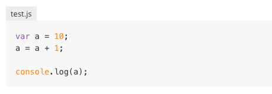

# Gitbook Plugin: Add Filename to Codeblock

This is a gitbook plugin.

Add filename to	codeblock.

## Usage

You can install this plugin via NPM and save it to `package.json`.

```
$ npm install gitbook-plugin-codeblock-filename --save
```

Add the plugin to your `book.json`:

```
{
	plugins: [ "codeblock-filename" ] 
}
```

Then, you need only to insert before codeblock the code below.

<pre><code>
filename
```
codeblock
```
</code></pre>


## Example

write this code ↓

<pre><code>
test.js
```js
var a = 10;
a = a + 1;

console.log(a);
```
</code></pre>

then result is ↓


